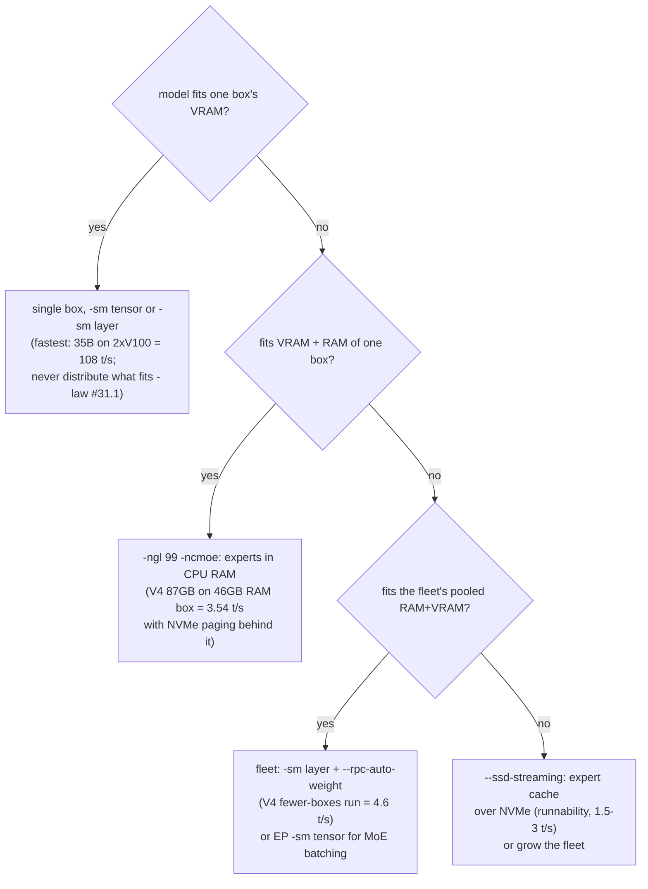
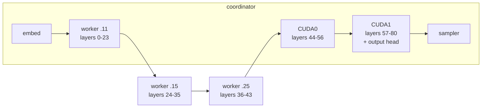
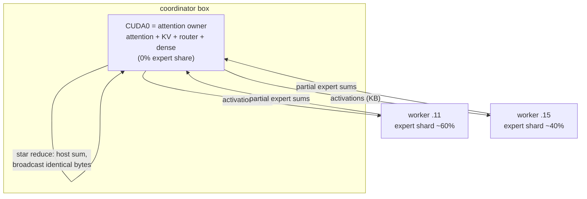
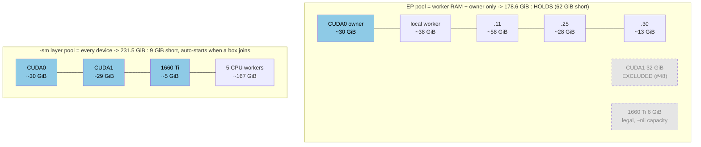
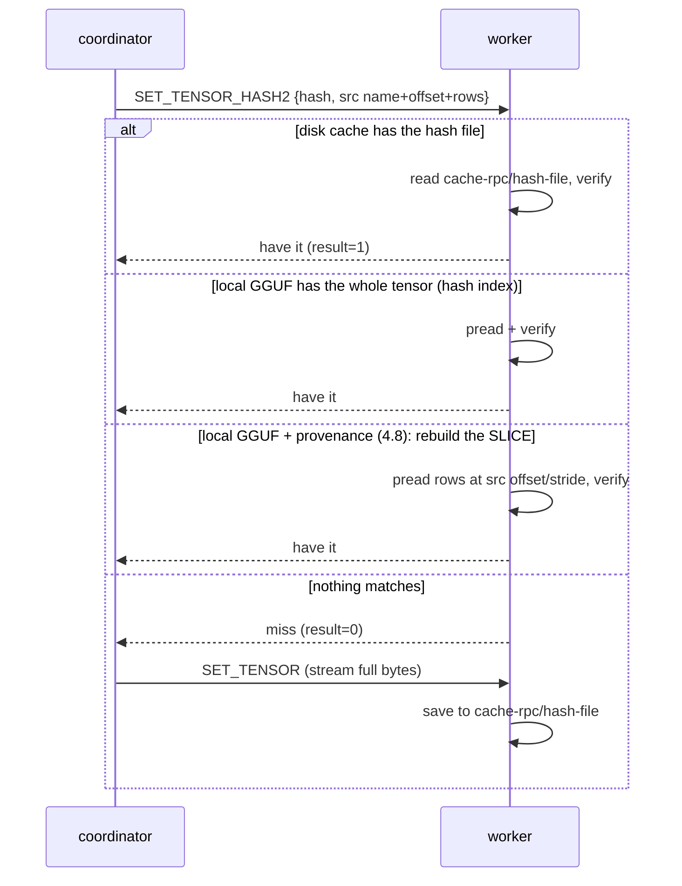
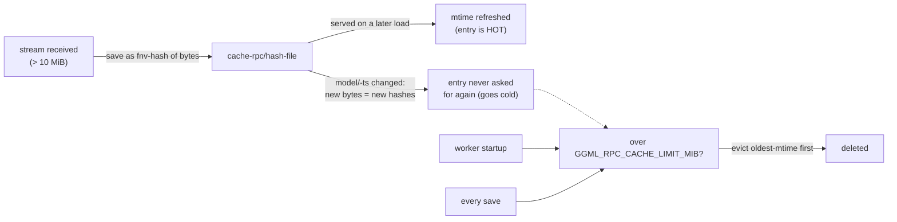
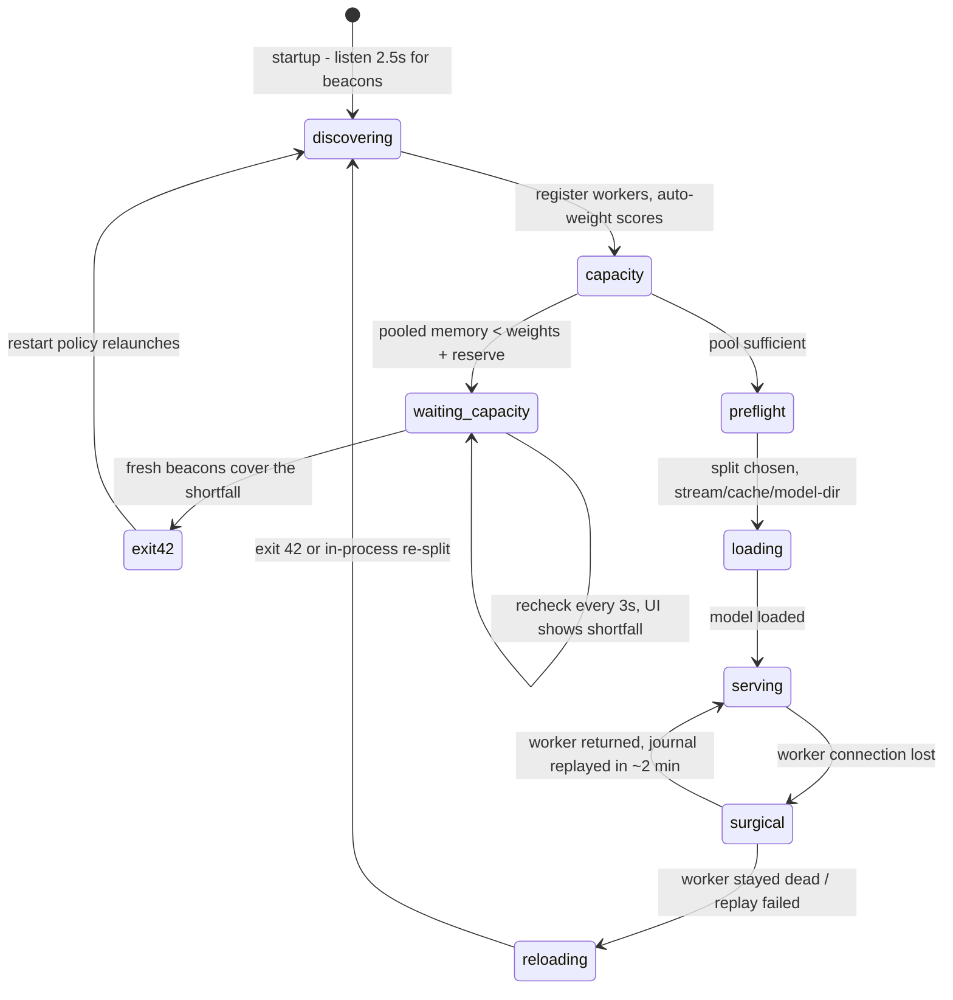
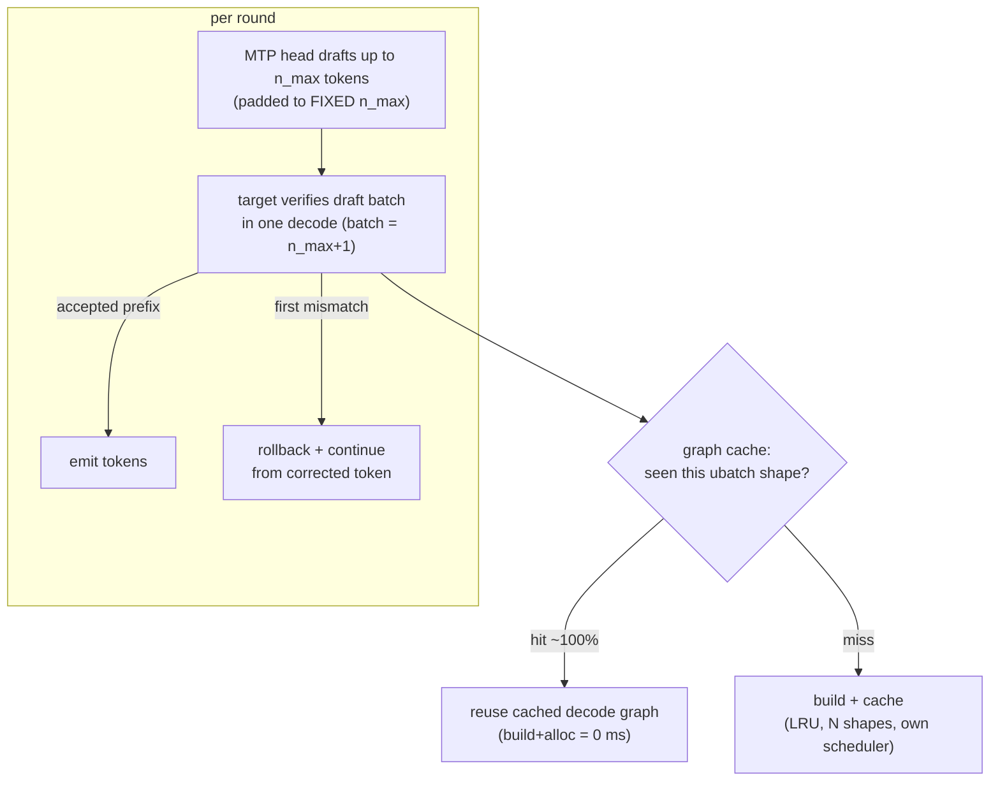
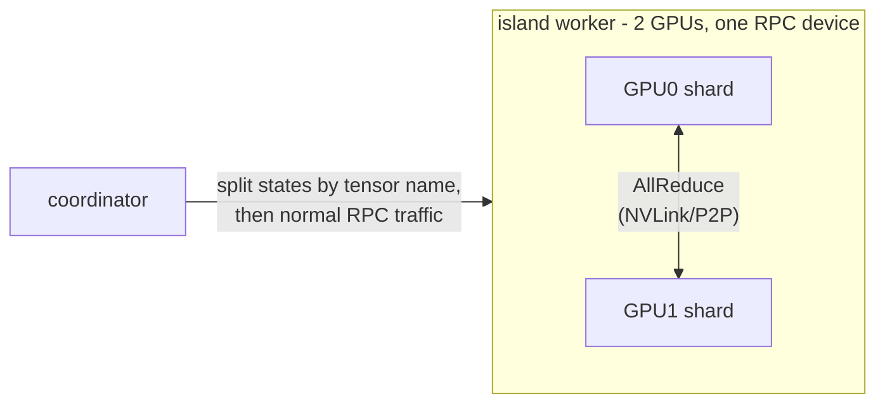
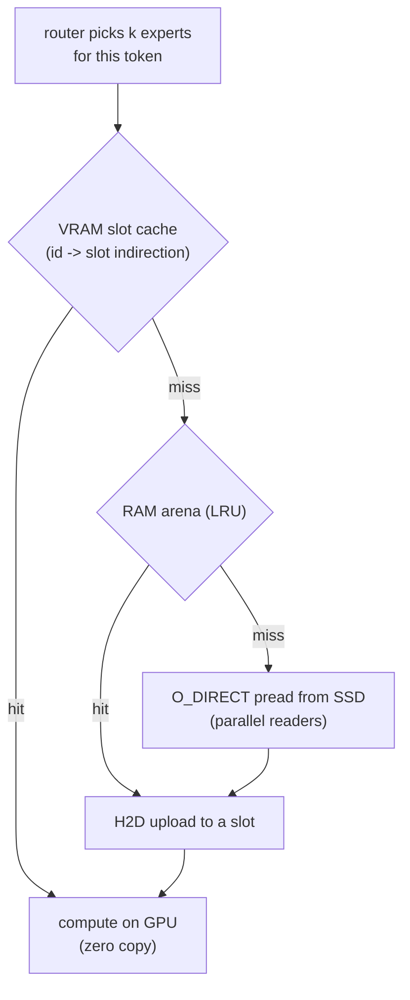

# Architecture diagrams

Visual companion to [distributed-inference-guide.md](distributed-inference-guide.md),
[expert-parallel-plan.md](expert-parallel-plan.md) and [ssd-streaming-plan.md](ssd-streaming-plan.md).
Each diagram answers one architectural question; measured numbers are from
TASKS.md and are V100-fleet-specific (your hardware will differ, the *shapes* won't).
GitHub renders the mermaid blocks natively.

## 1. Which mode do I run? (placement decision map)

The first question is always capacity: where do the weights fit?

Rules of thumb baked into the arrows: distribution *loses* whenever a smaller
config holds the model (sum-of-stages); the fleet's win over `-ncmoe` is
removing the disk from the token loop, not adding compute.

## 2. Layer-split pipeline (`-sm layer`)

One contiguous slab of layers per device, in device-list order (RPC workers
first). Per token, the hidden state walks the stages in order — time is the
SUM of stages plus hops, so slow boxes tax every token.

- Activation per hop: hidden x 2-4 B (tens of KB) — the network carries almost
  nothing per token; bandwidth matters at *load*, latency at *decode*.
- The split is share-proportional: `--rpc-auto-weight` sizes slabs by each
  box's measured memory bandwidth, capacity-capped (KV + compute reserve).
- Composition law: t/s ~ 1 / SUM(slab_i / bw_i + hop_i). Removing a slow
  stage speeds up every token (measured: 9 stages 1.0 -> 5 stages 3.4 ->
  3 stages 4.6 t/s on the same V4 model).

## 3. Expert-parallel (`-sm tensor` + `LLAMA_META_ATTN_OWNER`)

For MoE models: only the routed experts are split; one local GPU owns
attention/KV/router; workers hold expert shards. The composition law flips
from SUM-over-stages to MAX-over-contacted-workers.

- Per MoE layer boundary: ONE fused message per worker (proto 4.5/4.6
  `GRAPH_FUSED`: carries the previous reduced value + the next subgraph chain
  + returns the boundary partial in the same response).
- Single-stream is RTT-serialized (~43 boundaries x RTT; workers idle >90%).
  Batching is the scaling axis: B=8 measured x2.85 aggregate.
- Constraint: exactly ONE local GPU may be a member (the owner); a second
  local GPU as expert member corrupts the reduce (#48, rejected at load).
  REMOTE GPUs (a worker box's GPU) are legal members — they are just RPC
  devices — but a small-VRAM card contributes little expert *capacity* while
  adding a serialized hop, so worker RAM is usually the better member.
- Slow-LINK boxes must stay out of the ring entirely: the cost is per
  boundary, not per byte (100-Mbit member = 0.42 vs 1.82 t/s, #28).

### 3b. The capacity law: whose memory counts (layer vs EP)

EP pools only what can hold *experts* — the owner takes no expert share and
the second local GPU is excluded (#48) — while `-sm layer` pools every
device. Worked example, GLM-5.2 Q2_K_XL (226.9 GiB + 8 GiB reserve =
**240.5 GiB required**) on this fleet, 2026-07-21:

- The capacity gate prints exactly this math and, under `--rpc-discover`,
  holds the load and starts it automatically when a new box beacons.
- Sharded GGUFs are sized as the SUM of all `-NNNNN-of-NNNNN` siblings
  (fixed 2026-07-21: 0-based `llama_split_prefix` — before that every
  sharded model was silently sized as shard 1 alone, and auto-weight could
  hand a worker more than its RAM).

## 4. Weight distribution on load (proto 4.8)

Per tensor/slice > 10 MiB, the coordinator offers a content hash before
streaming. The worker satisfies it from the cheapest source it has; every
serve is re-hash-verified, so a stale file degrades to streaming, never to
corruption.

The 4.8 slice branch is what makes `-ts`/auto-weight share changes
stream-free on `--model-dir` boxes: boundaries move, hashes change, but the
provenance (tensor name + row range) still resolves against the local GGUF
(measured -71% wire bytes on a boundary-moved load). Older workers simply
never see HASH2 (version-gated) and keep the first three branches.

## 5. Worker cache lifecycle (housekeeping, #45)

Entries are never *invalidated* — they are content-addressed, so correctness
is settled by the verify-on-read; they just go cold when nothing offers their
hash anymore. The LRU cap (enforced on every save AND once at startup) is
what reclaims them; the beacon's `cache_mib=` makes the pressure visible in
the fleet UI.

## 6. Fleet lifecycle (discovery, capacity gate, recovery)

The same exit-42 edge powers three flows: the capacity gate, the fleet UI's
Include button, and `--rpc-reload` worker-loss recovery — one mechanism,
"restart and re-discover whoever is present".

## 7. MTP speculative decoding under tensor-split

MTP (multi-token prediction) models carry a trained NextN/MTP layer. The fork
runs it as a self-speculative draft: the MTP head drafts N tokens, the target
verifies them in ONE batched decode. Two things make this work on the
2-GPU tensor-split (meta) backend:

- **Draft padding**: variable-length drafts would change the batch shape every
  round and defeat graph reuse; padding to a fixed `n_max` keeps ONE shape
  (33.6 -> 62-65 t/s single-stream when introduced).
- **Multi-shape decode graph cache**: each cached graph carries its own
  scheduler + meta shadow ring slot, so the tensor-split backend replays
  without rebuilding split states (prod: 27B ~81 t/s, 35B ~166 t/s serving).
- Acceptance is the whole game: ~88% on the prod models; hy_v3 needs
  `p-min 0.75` (its single-depth head collapses at the default).

## 8. TP island (worker-side tensor parallel)

A worker with >= 2 GPUs can expose them as ONE device (`--tensor-parallel`);
the coordinator uploads per-tensor split states so the island shards
weights/KV internally (NVLink/P2P AllReduce inside the box, one RPC endpoint
outside).

## 9. ssd-streaming (3-tier expert placement, single box)

For MoE models bigger than RAM: non-expert weights stay resident; routed
experts stream on demand with two caches in front of the SSD.

Hit rates beat projections (73% at 30 GB cache for V4-class routing skew);
the regime is IO-bound runnability, not speed — the fleet (diagram 1) is the
faster answer whenever pooled RAM exists.
