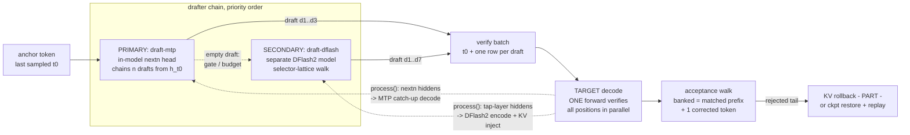
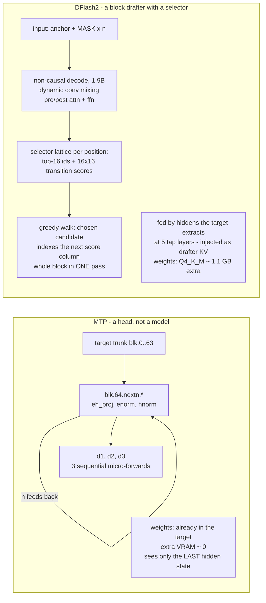

# Dual drafters

How `llama-server` runs two speculative drafters at the same time (#132 secondary
drafter + #138 DFlash2), what each drafter is, and where the measured sweet spots
sit. Visual companion to [speculative.md](speculative.md); the numbers are from
TASKS.md #138 and are V100-fleet-specific (your hardware will differ, the *shapes*
won't). GitHub renders the mermaid blocks natively.

## 1. One decode round (priority-fallback, not a race)

The drafter chain is ordered. The primary drafts first; a sequence that receives a
non-empty draft is done for the round (its `drafting` flag clears), so the
secondary only ever drafts sequences the primary left empty - its gates fired, or
its budget hit zero. Whatever was drafted rides one batch through the target,
which verifies every position in parallel. That single wide decode is where the
whole speedup comes from, and because the target verifies everything, a weak
draft can only cost speed, never correctness.



Notes:

- Both drafters re-sync from the target's hidden states EVERY round via
  `process()`, even on rounds they did not draft - the standby drafter stays warm.
- At `temperature > 0` a stochastic DFlash2 draft records its proposal
  distributions and verification switches to maximal-coupling acceptance
  (`u*q <= p`, clamped-residual resample) on targets that support direct partial
  rollback - still lossless. Everything else uses the plain greedy walk plus
  standard verification.
- The spec tree never arms with a DFlash2 drafter (it pushes no alt candidates).

## 2. What each drafter is

They share nothing internally, which is exactly why one can back the other up.



The hinge: MTP pays no extra weights but inherits the target's view of the last
token only; DFlash2 pays a small separate forward but proposes a whole block from
a five-layer view of the target's state. Different failure modes - the reason the
fallback chain is capability insurance.

## 3. Launching it

The secondary is env-gated (#132) and stacks on any primary:

```bash
# MTP primary (in-model head) + DFlash2 secondary - fits ONE 32GB V100,
# because MTP adds no weights and DFlash2-Q4 is ~1.1 GB
LLAMA_SPEC_DRAFT2=/models/Qwen3.8-27B-DFlash2-Q4_K_M.gguf \
LLAMA_SPEC_DRAFT2_TYPE=draft-dflash \
LLAMA_SPEC_DRAFT2_DEVICE=CUDA0 \
llama-server -m Qwen3.8-27B-UD-Q4_K_XL.gguf -ngl 99 -fa on \
    --spec-type draft-mtp --spec-draft-n-max 3 --spec-draft-p-min 0.75
```

The reverse order (DFlash2 primary, MTP secondary) forces a second full target
instance for the MTP model file and only fits multi-GPU boxes. DFlash2 is
auto-detected inside `draft-dflash` by its `dflash.selector_top_k` metadata;
the serve log confirms with `DFlash2 selector active` and
`drafter2 ... registered behind the primary`.

## 4. Measured sweet spots (2026-08-24, temp 0, 3-4x128-token runs)

Single V100 (32GB, target + both drafters resident, 8k ctx f16 KV):

| config                              | prose t/s | acceptance |
| ----------------------------------- | --------- | ---------- |
| MTP n3 solo                         | 47.5      | 67%        |
| dual: MTP primary + DFlash2 standby | 46.7      | 67%        |
| DFlash2-Q4 n4 p_min 0.5 solo        | 46.1      | 65%        |
| no drafter                          | 33.8      | -          |

X99, 2x V100 tensor split (`-ts 0.5,0.5`, 64k ctx q4_0 KV, drafter pinned to the
idle third GPU):

| config                                | prose t/s | code t/s   |
| ------------------------------------- | --------- | ---------- |
| MTP n3                                | 73.7      | 91.2       |
| DFlash2-Q4 n4 p_min 0.5, dev CUDA2    | 54.5      | 103.2 @99% |
| dual: MTP primary + DFlash2 on CUDA2  | 72.6      | 89.4       |

Reads that generalize:

- Task type dominates every other knob: structured output (code, math) accepts
  far better than prose, and at very high acceptance the LONGER block wins - so
  DFlash2 owns code while MTP owns prose.
- `--spec-draft-p-min` is DFlash2's key knob (stop drafting when unsure): 0.5
  lifted acceptance 55% -> 65% on the same serve. p_min truncates the harvest,
  not the drafter's block decode, so the smallest `--spec-draft-n-max` that fits
  the typical accepted span wins on bandwidth-bound GPUs (n4 on V100-class;
  long n only ties once verify width is cheap, e.g. split across two GPUs).
- The dual configuration is capability, not speed: the entropy-threshold mixing
  curve between the two drafters is monotone, so its value is the live standby
  (under 1 t/s premium over the primary alone), plus per-workload switching.

## 5. Post-guide updates (2026-08-25/26)

Landed after the sections above were written; the shapes there still hold.

- **Fused MTP draft chain** (`LLAMA_SPEC_MTP_FUSED`, #140): the primary's n
  micro-forwards collapse into ONE decode graph. Verdict: byte-identical,
  draft-stream-identical, and speed-PARITY everywhere it runs — the per-step
  tax the fusion targeted turned out to be verify-row cost on the MoE target
  (~9.2 ms/row), not draft round-trips. Auto-disabled on row/tensor-split
  models (in-graph argmax needs a single-owner logits row); engages cleanly
  under the ngram-mod stack. Opt-in.
- **Confidence-gated tree arming** (`LLAMA_SPEC_TREE_CONF`, #141): the spec
  tree can now arm only on low-confidence rounds. The gate works (take-rate
  triples) but every setting stays below the no-tree line — tree-as-built is
  structurally unpayable at V100 verify-row prices. Lane parked; keep the
  tree off in production.
- **DSpark drafter** (#142): `RadixArk/Qwen3.8-27B-DSpark` converts cleanly
  (the `DSparkDraftModel` architecture alias) and runs as `draft-dspark`, but
  MTP n2 beats it on both prose and code — no published drafter beats the free
  in-model head on this stack. The apparent "~2x SGLang acceptance gap" was a
  METRIC ARTIFACT (reference numbers are acceptance LENGTH at temp 1 with
  lossless rejection sampling; converted apples-to-apples we are AT or ABOVE
  reference). The acceptance wall is the drafter checkpoints' training data,
  not the fork.
- **Standby premium is box-dependent** (#138 X99 ladders): the DFlash2-Q4
  DRAFT2 standby cost 0.83 t/s on the local V100 but -2 t/s on the X99 1-GPU
  shape, where it was CUT from the stored winner config (ngram-mod + MTP n2).
  Measure the premium on the serving box before keeping the standby.
