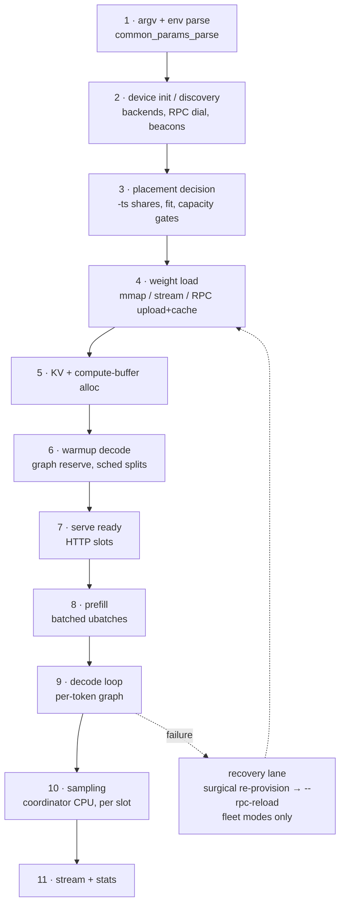
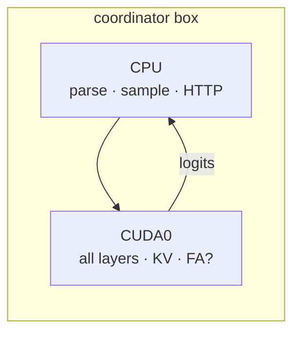
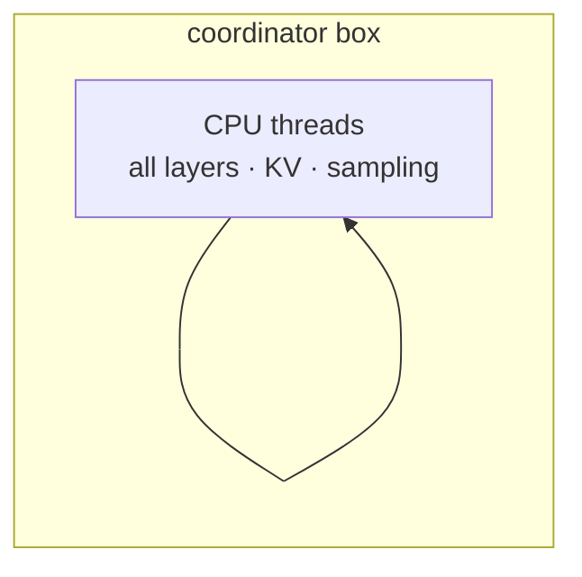
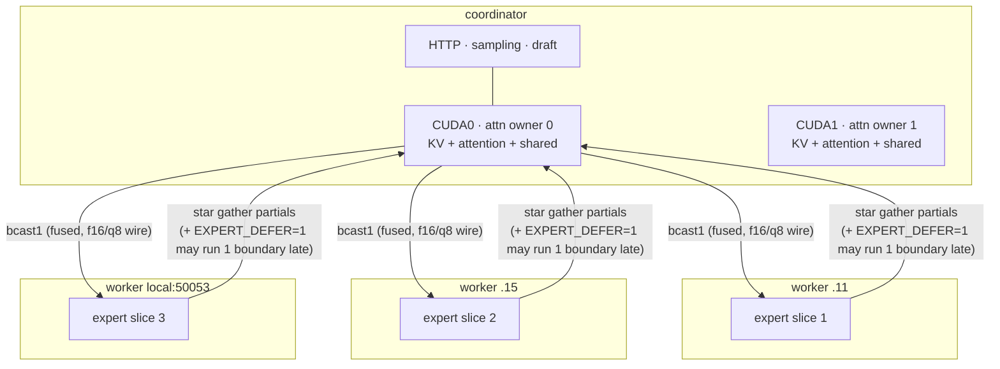
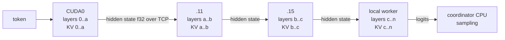
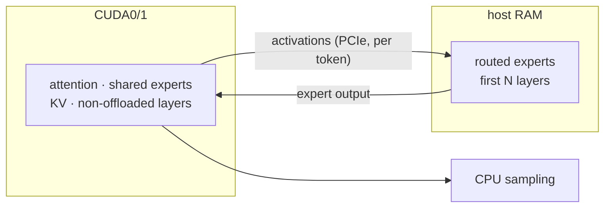

# Serve-mode process analysis — end-to-end stage comparison (2026-08-02)

> **Status update (33f57748a):** findings 1, 3, 8 and the finding-2 gate
> removal are FIXED in the wizard templates (gpu1 `-fa on`; KV-asymmetry
> notes on both fleet cards; `--load-mode none` everywhere;
> `ALLOW_MULTI_LOCAL` dropped from the EP stack). Still open: 2 (CPU `-t`
> sweep), 4 (layer-hop wire compression), 6 (ncmoe prefill `GGML_SCHED_DEBUG`
> run — needs idle GPUs), 7 (single-box restart-on-crash), 9 (observability).

Five modes compared from the process standpoint — every stage from argv to
streamed tokens — to surface anything **missing or odd** per mode. Flag stacks
are the wizard's own mode templates (source of truth: `wizard.html` modesFor).

| Mode | Wizard template (core) |
|---|---|
| **Single GPU** (`gpu1`) | `-ngl 99 -c CTX --no-mmap` |
| **CPU only** (`cpu`) | `-ngl 0 -c CTX` (mmap stays on) |
| **EP fleet** (`fleet`) | `--rpc … --rpc-reload --device … -sm tensor -ts … -ngl 99 --no-mmap -fit off` + `LLAMA_META_EP_ONLY=1 LLAMA_META_ATTN_OWNER=0,1 LLAMA_META_ALLOW_MULTI_LOCAL=1 LLAMA_FLEET_KV_RESERVE_MB=6144 GGML_META_BCAST_FUSE=2 GGML_RPC_WIRE_F16=1 GGML_RPC_WIRE_Q8=1 GGML_META_EXPERT_DEFER=1` |
| **Layer fleet** (`fleetl`) | `--rpc … --rpc-reload --device … -sm layer -ts … -ngl 99 --no-mmap -fit off` (no meta env stack) |
| **GPU+MoE offload** (`ncmoe`) | `-ngl 99 -ncmoe N -c CTX --no-mmap -fa on` |

---

## 1. The shared stage ladder

Every mode passes through the same eleven stages; what differs is **who does
the work at each stage and what can go wrong there**.

---

## 2. Per-mode process shape

### Single GPU

- Stages 2–6 are trivial: one backend, `common_fit_params` (fit defaults ON)
  trims `-ngl`/ctx if tight. Weights stream RAM→VRAM once (`--no-mmap`).
- Steady state: zero inter-device traffic; PCIe carries only token ids down
  and logits up. Simplest failure surface: CUDA OOM at stage 5/6 or nothing.

### CPU only

- Only mode that keeps **mmap** (correct: weights stay file-backed, page cache
  is the working set). No `-fa`; no explicit `-t` (see findings).
- Failure surface: page-cache thrash if RAM < weights (silent slowdown, not
  a crash — the only mode whose "OOM" is invisible).

### EP fleet (meta backend, expert-parallel)

- Stage 3 is the richest: manual `-ts` (or `--rpc-auto-weight`),
  `LLAMA_FLEET_CAPACITY_CHECK` gate, `-fit off` (auto-fit disabled — the
  probing fights manual shares), KV reserve headroom env.
- Stage 4 is the most complex load path in the tree: per-member slices,
  worker manifest/cache dedup (review #11 fixed the optimism bug here),
  W2W pulls, `--fleet-preflight` option.
- Decode: 4 bcast + 3 star boundaries per graph (hy3 stub signature);
  deferral makes wire partials arrive one boundary late by design →
  nondeterministic-by-design, judged by counters + coherence READ.
- **KV lives on the local attention owners** → a worker drop loses experts
  but not conversation state; surgical re-provision can restore a returned
  worker's slice from its own cache without a full reload.

### Layer fleet (pipeline over RPC)

- Same discovery/reload lane as EP but **no meta env stack**: plain
  sequential pipeline, one hidden-state hop per device boundary per token.
- **KV is sharded across workers** (each device holds KV for its own
  layers) → a worker drop loses part of every conversation; `--rpc-reload`
  restores serving but the cache is gone.
- No boundary fusion, no wire compression, no deferral: per-token latency =
  sum of hops; workers idle while other stages run (pipeline bubble at
  batch 1). This is why EP is the record roster and layer is the fallback.

### GPU + MoE offload (ncmoe)

- Single-box, split by **tensor role** not layer: router+attention on GPU,
  routed experts of the first N layers pinned in RAM.
- Decode: one CPU expert-matmul detour per offloaded layer per token
  (activations cross PCIe both ways).
- Prefill: batches ≥ `GGML_OP_OFFLOAD_MIN_BATCH` (default 32) may flip the
  expert matmul onto the GPU by shipping data across PCIe — see findings.

---

## 3. Stage-by-stage comparison

| Stage | Single GPU | CPU only | EP fleet | Layer fleet | ncmoe |
|---|---|---|---|---|---|
| 2 discovery | local CUDA | none | RPC dial + beacons + probe | same as EP | local CUDA |
| 3 placement | fit auto-trim | none | `-ts` + capacity gate + KV reserve, `-fit off` | `-ts` shares per layer, `-fit off` | `-ncmoe N` estimate (wizard admits guess) |
| 4 load | RAM→VRAM once | mmap only | slices + manifest cache + W2W | slices per layer owner | VRAM + pinned RAM split |
| 5 KV home | GPU | RAM | **local attn owners** | **sharded across workers** | GPU |
| 6 warmup risk | OOM | none | #95 fattn abort (open, auto-weight layouts) | foreign-view class (fixed, task 37) | OOM if N too low |
| 8/9 comms per token | none | none | bcast+gather ×(MoE layers), f16/q8 wire, defer | 1 hidden-state hop × (n_devices−1), uncompressed | PCIe activation round-trip × N layers |
| 10 sampling | coord CPU | same | same (+ MTP draft localized via `LLAMA_META_LOCAL_DRAFT`) | same | same |
| recovery | none (child dies → failed) | none | surgical → in-process reload → 503 after 30 s (review #1) | same reload lane, KV lost | none |
| observability | sched debug | — | BOUNDARY_STATS, RPC_STATS, ZL/UNION counters | RPC_STATS only | sched debug only |

---

## 4. Findings — odd or missing per mode

1. **Single GPU template never sets `-fa on`** while `ts`, `sml` and `ncmoe`
   all do. FlashAttention only arrives on `gpu1` indirectly when the user
   picks quantized KV (the `kvFlags` string appends `-fa on`). If FA is good
   enough for the tensor-split V100 path it is good enough for one V100 —
   looks like a template oversight, worth an A/B then a one-word fix.
2. **CPU mode sets no `-t`** — worker boxes went through a thread sweep
   (local worker `-t 8`, .11 `-t 6` P-cores) but a local CPU *serve* runs on
   llama.cpp's default thread heuristic on a 20-core box. Same sweep
   discipline would likely move its 1–4 t/s estimate.
3. **EP fleet production template carries `LLAMA_META_ALLOW_MULTI_LOCAL=1`**
   — documented in the gates catalog as the *task-48 corruption re-test gate*
   ("allows more local members than the owner group spans, with a WARN").
   With `ATTN_OWNER=0,1` the owner group already spans both locals, so the
   gate should be redundant; if it is ever load-bearing here, that's the
   task-48 configuration returning. Either drop it from the template or
   record why it must stay.
4. **Layer fleet ships hidden states uncompressed.** The f16/q8 wire ladder
   (`GGML_RPC_WIRE_*`) lives in the meta fused-boundary pipeline only — the
   layer pipeline's per-token hop is raw activation bytes. A 2-4× wire cut
   exists one mode over but doesn't apply here; either port the compression
   to plain hops or note it as a known structural cost of `fleetl`.
5. **Layer fleet KV placement is the fragile one**: sharded across workers,
   so the recovery lane (reload) saves the serve but every conversation
   loses its cache; EP keeps KV on the coordinator's GPUs and survives the
   same event with state intact. Wizard mode notes don't mention this
   asymmetry — the user picking between fleet modes never sees it.
6. **ncmoe prefill path is unverified**: whether batched prefill runs the
   offloaded experts on CPU or flips them to GPU depends on the upstream
   `GGML_OP_OFFLOAD_MIN_BATCH=32` heuristic; one `GGML_SCHED_DEBUG=1`
   prefill run would pin down which side pays, and whether the wizard's
   ncmoe speed estimate is modeling the right thing.
7. **No recovery lane outside the fleet modes.** A single-box child that
   crashes goes to `failed` and stays there until a human reloads; the
   router has restart machinery for workers but no restart-on-crash policy
   for children. Fleet gets three layers of self-heal, single-box gets zero
   — a small `restart: on-failure`-style policy would close the gap.
8. **Templates still use the deprecated `--no-mmap`** (works, and review #2
   made the shims compose safely, but the canonical spelling is
   `--load-mode none`). Cosmetic; migrate when the templates are next
   touched.
9. **Observability asymmetry**: EP has counters for everything
   (boundaries, deferral, zero-legs, unions); layer fleet has only
   RPC_STATS; ncmoe/gpu1 have only generic sched debug. Anywhere a "why is
   it slow" question lands outside EP mode, the instruments are thinner.

## 5. Verdict

No mode has a missing *stage* — all five walk the same ladder, and the fleet
modes add a recovery lane the single-box modes lack. The oddities are
concentrated in **defaults and asymmetries** (findings 1–3: template flags;
4–6: cost/fragility that only shows under failure or prefill; 7–9: process
gaps). Findings 1, 2, 3 and 8 are one-line template edits; 5 and 9 are
documentation; 6 is a single instrumented run; 7 is the only real feature.
